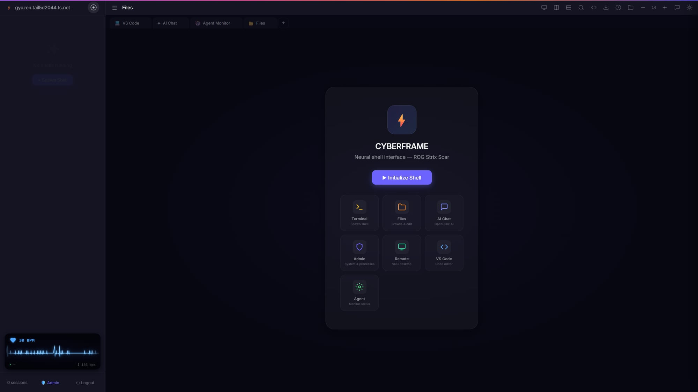
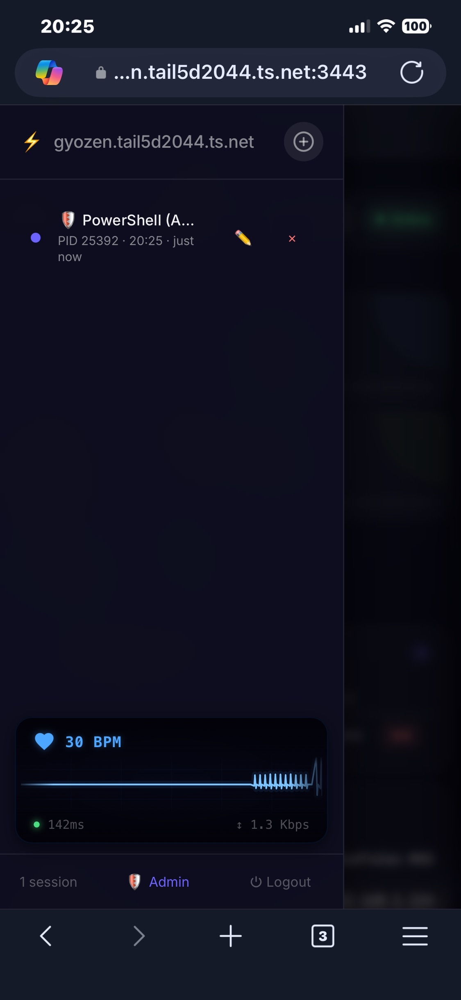

# ⚡ CYBERFRAME

**Neural Shell Interface** — Web-based terminal with AI chat, agent monitoring, remote desktop, file manager, and cyberpunk UI.


## ✨ Features

### 🖥️ Multi-Shell Terminal
- **Persistent sessions** — tmux-like architecture; disconnect without killing the process, reconnect and resume exactly where you left off
- **7 shell profiles** — PowerShell (⚡), PowerShell Admin (🛡️), Windows PowerShell (🔵), CMD (⬛), CMD Admin (🛡️), Git Bash (🟠), WSL Ubuntu (🐧)
- **🛡️ Admin shells** — run as administrator via [gsudo](https://github.com/gerardog/gsudo) (sudo for Windows), UAC prompt on first use then cached
- **Auto-detect** available shells at startup — only shows what's actually installed
- **Scrollback buffer** — 50,000 characters retained per session
- **Session idle timeout** — auto-cleanup after 30 minutes of inactivity
- **Session rename** — double-click session name to rename
- **Multiple concurrent sessions** — run as many shells as you need simultaneously

### 📑 Multi-Tab Interface
- **Tab bar** — each session opens in its own tab with dedicated terminal instance
- **Mixed tabs** — terminal, editor (Monaco), preview, and admin dashboard tabs
- **`+` button** — spawn new shell tab from tab bar
- **Keyboard shortcuts** — `Ctrl+S` save editor tab, `Ctrl+W` close active tab
- **Per-tab xterm** — no more detach/attach; switch tabs instantly
- **Auto-fit** — terminal resizes on tab switch and window resize

### ⫿ Split Pane
- **Horizontal split** — side-by-side terminals (⫿ button)
- **Vertical split** — top/bottom terminals (⫻ button)
- **Nested splits** — split the active pane again for 3–4 pane layouts
- **Drag & drop split** — drag a session card from sidebar onto the terminal area; drop on Left/Right/Top/Bottom zones to create a split with that session
- **Per-pane drop zones** — when already split, each pane shows its own drop zones for targeted nested splits
- **Drag header to swap** — drag a pane's header bar onto another pane's header to swap their positions
- **Draggable resize handle** — smooth `requestAnimationFrame` animation
- **Active pane highlight** — purple border + centered title with accent color
- **Sidebar sync** — click a session in sidebar to focus its pane
- **Buffer preservation** — text content survives split and swap operations
- **Session guard** — prevents the same session from being opened in multiple tabs
- **Desktop only** — hidden on mobile (< 1024px)

### 🔍 Terminal Search
- **Ctrl+F** to search — intercepts browser search, uses xterm's built-in search addon
- **Navigate results** — ▲ Previous / ▼ Next buttons or Enter/Shift+Enter
- **Real-time highlight** — matches highlighted as you type
- **Esc to close** — returns focus to terminal

### ⚡ Command Snippets
- **Save frequently used commands** — name, command, and optional category
- **One-click execute** — click a snippet to run it in the active terminal session
- **Persistent storage** — saved to `snippets.json`, survives server restarts
- **Categories** — organize snippets with tags (e.g. `git`, `docker`, `system`)
- **Slide-in drawer** — accessible from toolbar, doesn't block terminal view

### 📥 Export Terminal Output
- **Download as .txt** — click the export button in toolbar
- **ANSI stripped** — clean plain text, no escape codes
- **HTML export** — preserves terminal styling (dark background, monospace font)
- **Named files** — exported with session name as filename

### 🖼️ Remote Desktop
- **TightVNC + noVNC** integration — full remote desktop in your browser
- **In-tab VNC** — opens as a CYBERFRAME tab (iframe), not a separate window
- **WebSocket proxy** — no extra ports needed, VNC traffic tunneled through the same server on `/vnc-ws`
- **View & control** your desktop from any device — mouse, keyboard, clipboard sharing
- **One-click connect** — toolbar button or welcome card opens VNC tab instantly
- **Reuse tab** — clicking again switches to existing VNC tab

### 💻 VS Code Integration
- **VS Code serve-web** — full VS Code editor running as a CYBERFRAME tab
- **Reverse proxy** — proxied through `/vscode/` on same port, no extra port needed
- **Asset proxying** — `/stable-*` paths transparently proxied to VS Code server
- **WebSocket support** — VS Code's WS connections proxied for full functionality
- **Auto-detect** — connection token detected from running process
- **CYBERFRAME auth** — protected by same login session, no separate VS Code auth needed
- **In-tab iframe** — opens as a tab like terminal, chat, admin, etc.

### 📁 File Manager
- **Browse, upload, download** files from any drive on the system
- **Drive selector** — switch between C:, D:, etc. with free space indicators
- **Drag & drop upload** — drop zone at bottom of file list with visual feedback (purple highlight)
- **New File / New Folder** — create directly from the file manager toolbar
- **Rename** — click to select a file, then rename with one click
- **File type icons** — visual indicators for 30+ file types (folders 📁, images 🖼️, code 📄, etc.)
- **System files hidden** — automatically filters out `$Recycle.Bin`, `NTUSER.DAT`, `.sys`, `.tmp`, `.blf`, `.regtrans-ms`, junction points, etc.
- **Breadcrumb navigation** — click any path segment to jump directly
- **File info panel** — select a file and click ℹ️ to see full path, type, size, and modified date
- **Favorites** — ★ star files/folders for quick access, persisted in `localStorage`
- **Refresh button** — reload current directory without navigating away

### 👁️ File Preview
- **Code viewer** — syntax highlighting for 25+ languages (JavaScript, Python, TypeScript, Go, Rust, Java, C/C++, C#, PowerShell, Bash, SQL, HTML, CSS, YAML, TOML, and more) powered by [highlight.js](https://highlightjs.org/) with Tokyo Night Dark theme
- **Line numbers** — separate scrollable column, synced with code view
- **Markdown preview** — GitHub-style rendering via [marked.js](https://marked.js.org/) + [github-markdown-css](https://github.com/sindresorhus/github-markdown-css) dark theme, with syntax-highlighted code blocks and copy buttons
- **HTML web preview** — render `.html` files as live webpages in iframe
- **Toggle view** — switch between code/preview mode with one click (for `.md` and `.html` files)
- **Image viewer** — full zoom support:
  - 🖱️ Scroll wheel to zoom in/out (25%–500%)
  - ✋ Click and drag to pan
  - 👆 Double-click to toggle 100% ↔ 200%
  - 🔘 Zoom controls: [−] level [+] ⟲ reset
- **PDF viewer** — inline iframe, native browser PDF rendering
- **JSON formatter** — auto pretty-print with indentation
- **Full-screen overlay** — blurred backdrop, max-width 1200px centered, Esc to close
- **Download button** — always accessible from preview header

### ✏️ Text Editor (Monaco / VS Code)
- **Monaco Editor** — the same editor that powers VS Code, running in your browser
- **Syntax highlighting** — 25+ languages with bracket pair colorization
- **Minimap** — code overview panel on the right
- **IntelliSense-ready** — auto-closing brackets, indentation guides, line highlight
- **Ctrl+S to save** — saves directly to the server filesystem
- **Unsaved indicator** — purple "● Modified" badge when content differs
- **JSON auto-format** — pretty-prints JSON files on open
- **Glassmorphism confirm** — custom styled dialog for unsaved changes (no ugly browser popups)

### 🎨 Themes
8 built-in terminal color schemes, persisted in `localStorage`:
- 🔮 **Cyberframe** (default) — deep purple cyberpunk
- 🌃 **Tokyo Night** — soft blue city lights
- 🧛 **Dracula** — classic dark with vibrant accents
- 🐱 **Catppuccin Mocha** — warm pastel tones
- 🍂 **Gruvbox Dark** — retro warm earth tones
- ❄️ **Nord** — arctic cool blue palette
- 🌆 **Synthwave** — neon retrowave
- ☀️ **Solarized Dark** — precision-engineered contrast

### 📱 Mobile Ready
- **Special keys bar** — horizontal scrollable bar with: Esc, Tab, Ctrl, Alt, Fn, ▲▼◀▶ arrows, PgUp/PgDn, Del, Home, End, `|`, `/`, `.`, `~`, `_`, `-`
- **One-shot modifier toggle** — tap Ctrl (turns purple) → type any key → sends combo (e.g. Ctrl+C) → auto-clears
- **Clipboard integration** — 📋 Copy (terminal selection) / 📥 Paste (from clipboard with prompt fallback)
- **Font size controls** — A- / A+ buttons, range 8–32px, persisted in `localStorage`
- **Responsive sidebar** — hidden by default, hamburger ☰ toggle with backdrop overlay
- **iOS Safari support** — `100dvh` viewport fix, safe area insets, `touch-action: manipulation`
- **Touch-friendly** — minimum 44px tap targets, no hover-dependent UI

### 🛡️ Admin Panel (`/admin`)
- **System Monitor** — real-time CPU%, RAM%, Disk, GPU (nvidia-smi), Uptime with progress bars (auto refresh 5s)
- **GPU Monitoring** — utilization %, temperature, power draw, VRAM usage
- **Session Manager** — view all active sessions, kill remotely
- **Process Manager** — top 20 processes by memory, kill by PID
- **Network Info** — hostname, local IP, Tailscale IP, Node version, platform
- **Server Info** — PID, memory (RSS + heap), server uptime, shell profile count
- **Quick Actions** — New Shell, Kill All Sessions, Remote Desktop, Copy IP, Export Logs
- **Activity Log** — real-time server activity viewer
- **REST API** — `GET /api/admin/status`, `GET /api/admin/processes`, `POST /api/admin/kill-process`, `GET /api/admin/server`

### 💬 AI Chat (OpenClaw)
- **SSE streaming** — real-time token-by-token response via Server-Sent Events
- **Multi-session** — sidebar with session list, create/rename/delete/switch sessions
- **Auto-title** — session automatically titled from first message
- **Markdown rendering** — full GitHub-style markdown via [marked.js](https://marked.js.org/)
- **Syntax highlighting** — code blocks with language badge, copy button, [highlight.js](https://highlightjs.org/) Tokyo Night Dark theme
- **Model selector** — switch between models (Default/OpenClaw/Custom) per session
- **System prompt presets** — Default, Code Expert, Thai Teacher, Creative Writer, Concise, or Custom
- **Stop generating** — abort streaming mid-response with AbortController
- **Regenerate** — re-send last message for a new response
- **Copy buttons** — per-message copy to clipboard
- **Chat search** — `Ctrl+F` to search messages with highlight
- **Export** — download conversation as `.md` file
- **Token counter** — live estimate of tokens used
- **Timestamps** — HH:MM on each message
- **Avatars** — 👤 User (purple) / ✦ Assistant (accent)
- **Typing indicator** — bouncing dots animation during streaming
- **Smart scroll** — auto-scroll only when near bottom
- **Keyboard shortcuts** — `Ctrl+F` search, `Ctrl+Shift+N` new session, `Ctrl+/` toggle sidebar, `Escape` close
- **Mobile bottom sheet** — system prompt opens as iOS-style bottom sheet with handle bar and backdrop
- **SVG icon buttons** — gear, search, export, clear with hover/active effects

### 🤖 Agent Monitor
- **Real-time status** — online/offline indicator with pulsing dot animation
- **Status cards** — Model, Sessions count, Heartbeat interval, Channel status
- **Active Sessions list** — all OpenClaw sessions with source badges:
  - ⚡ **CYBERFRAME** (yellow) — sessions from this app
  - 💬 **Discord** (blue) — Discord channel sessions
  - 🤖 **Sub-Agent** (purple) — spawned sub-agents
  - 🏠 **Main** (green) — main agent session
- **Session management** — hover actions on each session:
  - 👁 **Preview** — modal showing transcript with avatars, timestamps, role colors
  - 💬 **Restore** — load CYBERFRAME transcript back into chat tab (CYBERFRAME sessions only)
  - ℹ️ **Info** — session metadata: key, ID, type, dates, file size, message count, compactions, origin
  - ✕ **Delete** — danger confirmation dialog, slide-out animation on remove
- **Display names** — chat session names shown above session keys
- **Refresh button** — force cache invalidate with spinning icon
- **Async & non-blocking** — `openclaw status` runs asynchronously (~4.4s), never blocks event loop
- **Smart caching** — 30-second cache TTL, pre-warmed on server start, instant API response
- **Loading animation** — pulsing dot + shimmer "Connecting..." text

### 📑 Tab Drag & Reorder
- **Drag tabs** to reorder — purple indicator line shows drop position
- **Tab types** — terminal, editor, preview, admin, chat, agent-monitor, VS Code, VNC

### 💾 Workspace State Persistence
- **Tabs survive refresh** — all open tabs saved to `localStorage` every 10 seconds + on page close
- **Terminal reattach** — terminal sessions reconnect to the same PTY process after browser refresh (sessions are kept alive on server)
- **Chat history preserved** — AI Chat messages (last 100 per session), model selection, and system prompts restored
- **VS Code workspace** — opened folder/project restored automatically via saved iframe URL
- **Tab order & active tab** — exact tab layout and which tab was active is remembered
- **Works for all tab types** — terminal, chat, VS Code, VNC, admin, agent monitor, editor

### 🎨 Visual Effects
- **Animated gradient top bar** — indigo → violet → purple → pink → orange gradient line at top of page with smooth animation
- **Neon scrollbar** — 3px ultra-slim scrollbar with animated gradient (indigo → violet → purple → pink → orange), glow effect on hover
- **Consistent across iframes** — scrollbar style applied to main UI, admin panel, and noVNC

### 💓 Heartbeat Monitor
- **Neon blue ECG** — 3D waveform with 4-layer glow, grid overlay, gradient mask fade edges
- **Animated heart** — pulses with each successful ping, neon blue glow
- **BPM display** — calculated from actual ping frequency (30 BPM = every 2 seconds)
- **Latency readout** — exact millisecond round-trip time
- **Bitrate indicator** — live WebSocket throughput in bps / Kbps / Mbps
- **Connection status** — green dot (connected) / red dot (disconnected) with pulse animation

### 🔔 Notifications
- **Browser notifications** — alerts you when a long-running command completes while the tab is in the background
- **Permission request** — asks for notification permission on first visit
- **Toast notifications** — in-app popup messages for file operations, connection status, errors, and confirmations
- **Auto-dismiss** — toasts disappear after 4 seconds with fade-out animation

### 🔄 Auto-Reconnect
- **Automatic WebSocket reconnection** — reconnects every 2 seconds when connection drops
- **Session re-attach** — automatically re-attaches to the previously active terminal session after reconnect
- **Visual feedback** — toolbar shows "↻ Reconnecting…" with pulse animation during disconnect
- **Toast alert** — notifies you of connection loss and successful reconnection

### 📋 Activity Log
- **Server-side audit trail** — logs login events, file saves, creates, renames, moves, and deletions
- **API access** — `GET /api/activity?limit=50` returns recent activity entries
- **In-memory store** — last 500 actions with timestamp, user, action type, and detail
- **Security auditing** — know who did what and when

### 🔒 Security
- **Session-based authentication** — Express session with configurable secret, 24-hour cookie lifetime
- **WebSocket auth check** — every WS upgrade request validates the session cookie; unauthorized connections are immediately destroyed
- **Credentials in `.env`** — username and password stored in environment file, never committed to git (`.gitignore`)
- **File delete with double confirm** — custom glassmorphism confirmation dialog, no accidental deletions
- **No external dependencies for auth** — self-contained, no third-party auth services required

---

## 🚀 Quick Start

### Prerequisites
- **Node.js** 18+
- **Windows** (uses `node-pty` for PTY)
- **TightVNC** (optional, for Remote Desktop)
- **gsudo** (optional, for Admin shells) — `winget install gerardog.gsudo`

### Install

```bash
git clone https://github.com/iDevGIS/WEB-TERMINAL-WIN.git
cd WEB-TERMINAL-WIN
npm install
```

### Configure

```bash
cp .env.example .env
```

Edit `.env`:
```env
TERM_USER=admin
TERM_PASS=your-secure-password
SESSION_SECRET=your-random-secret
PORT=3000
```

### Run

```bash
node server.js
```

Open `http://localhost:3000` in your browser.

### Remote Desktop (Optional)

1. Install [TightVNC](https://www.tightvnc.com/download.php)
2. Set a VNC password in TightVNC settings
3. Enable loopback connections:
   ```powershell
   Set-ItemProperty -Path "HKLM:\SOFTWARE\TightVNC\Server" -Name "AllowLoopback" -Value 1 -Type DWord
   Restart-Service tvnserver
   ```
4. Click the 🖥️ button in CYBERFRAME toolbar

---

## 📸 Screenshots

### Desktop

| Login | Welcome |
|-------|---------|
|  |  |

| Shell Picker | Terminal |
|-------------|----------|
|  |  |

| Split Pane | File Manager |
|-----------|-------------|
|  |  |

| Theme Switcher | Admin Panel |
|---------------|-------------|
|  |  |

| AI Chat | Agent Monitor |
|---------|--------------|
|  |  |

| VS Code (in-tab) | Multi-Tab |
|-------------------|-----------|
|  |  |

### 📱 Mobile (iOS Safari)

<table>
<tr>
<td width="25%"><strong>Login</strong><br></td>
<td width="25%"><strong>Welcome</strong><br></td>
<td width="25%"><strong>Terminal</strong><br></td>
<td width="25%"><strong>Sidebar</strong><br></td>
</tr>
<tr>
<td><strong>Admin Panel</strong><br></td>
<td><strong>File Manager</strong><br></td>
<td><strong>Monaco Editor</strong><br></td>
<td><strong>Sessions</strong><br></td>
</tr>
</table>

---

## 🌐 Remote Access via Tailscale

Access CYBERFRAME from anywhere using [Tailscale](https://tailscale.com/).

### 1. Install Tailscale

Download from [tailscale.com/download](https://tailscale.com/download) and sign in.

### 2. Serve CYBERFRAME over Tailscale (HTTPS)

```powershell
# Serve port 3000 over HTTPS on port 3443
tailscale serve --bg --https 3443 http://127.0.0.1:3000
```

Now access from any device on your tailnet:
```
https://your-machine-name.your-tailnet.ts.net:3443
```

### 3. (Optional) Funnel — Public Internet Access

```powershell
# Expose to the public internet (no tailnet required)
tailscale funnel --bg --https 443 http://127.0.0.1:3000
```

⚠️ **Warning:** Funnel exposes your terminal to the internet. Make sure you use a strong password!

---

## ⚙️ Auto-Start on Boot

### Option 1: Windows Task Scheduler (Recommended)

```powershell
# Create a scheduled task that runs at startup
$action = New-ScheduledTaskAction `
  -Execute "node.exe" `
  -Argument "server.js" `
  -WorkingDirectory "C:\path\to\WEB-TERMINAL-WIN"

$trigger = New-ScheduledTaskTrigger -AtStartup
$settings = New-ScheduledTaskSettingsSet -AllowStartIfOnBatteries -DontStopIfGoingOnBatteries -StartWhenAvailable

Register-ScheduledTask `
  -TaskName "CYBERFRAME" `
  -Action $action `
  -Trigger $trigger `
  -Settings $settings `
  -RunLevel Highest `
  -User "$env:USERNAME" `
  -Description "CYBERFRAME Web Terminal"
```

To remove:
```powershell
Unregister-ScheduledTask -TaskName "CYBERFRAME" -Confirm:$false
```

### Option 2: PM2 (Process Manager)

```powershell
# Install PM2 globally
npm install -g pm2

# Start CYBERFRAME
cd C:\path\to\WEB-TERMINAL-WIN
pm2 start server.js --name cyberframe

# Save process list & setup startup
pm2 save
pm2-startup install
```

PM2 commands:
```powershell
pm2 status          # Check status
pm2 logs cyberframe # View logs
pm2 restart cyberframe
pm2 stop cyberframe
```

### Option 3: Simple startup script

Create `start-cyberframe.bat` in your Startup folder:

```
Win+R → shell:startup → Enter
```

Create the file:
```bat
@echo off
cd /d "C:\path\to\WEB-TERMINAL-WIN"
start /min node server.js
```

---

## 🏗️ Architecture

```
CYBERFRAME
├── server.js              # Express + WebSocket + PTY + VNC proxy
├── .env                   # Credentials (git-ignored)
├── .env.example           # Template
└── public/
    ├── index.html         # Single-page app (all UI + JS + CSS)
    ├── favicon.svg        # Lightning bolt icon
    └── novnc/             # noVNC web client
```

### API Endpoints

| Method | Path | Description |
|--------|------|-------------|
| POST | `/api/login` | Authenticate with username/password |
| GET | `/api/logout` | Destroy session and redirect to login |
| GET | `/api/shells` | List available shell profiles |
| GET | `/api/sessions` | List active terminal sessions |
| POST | `/api/sessions` | Create new session (REST fallback) |
| DELETE | `/api/sessions/:id` | Destroy a terminal session |
| POST | `/api/sessions/:id/rename` | Rename a session |
| GET | `/api/sessions/:id/export` | Export session output (`?format=txt\|html`) |
| GET | `/api/files` | Browse directory (`?path=`) |
| GET | `/api/files/download` | Download a file (`?path=`) |
| POST | `/api/files/upload` | Upload file (base64 body) |
| GET | `/api/files/drives` | List drives with free space |
| GET | `/api/files/preview` | Preview file content (`?path=`, max 5MB) |
| PUT | `/api/files/save` | Save file content (text editor) |
| POST | `/api/files/new-file` | Create new empty file |
| POST | `/api/files/new-folder` | Create new folder |
| POST | `/api/files/rename` | Rename file or folder |
| POST | `/api/files/move` | Move file or folder |
| GET | `/api/snippets` | List saved command snippets |
| POST | `/api/snippets` | Add new snippet |
| DELETE | `/api/snippets/:id` | Delete a snippet |
| GET | `/api/activity` | Activity log (`?limit=50`, max 500) |
| POST | `/api/chat` | AI Chat — SSE streaming to OpenClaw gateway |
| GET | `/api/agent/status` | Agent status (cached, `?force=1` to refresh) |
| GET | `/api/agent/sessions` | List all agent sessions from store |
| GET | `/api/agent/sessions/preview` | Preview session transcript (`?key=`) |
| GET | `/api/agent/sessions/info` | Session metadata & file stats (`?key=`) |
| POST | `/api/agent/sessions/delete` | Delete session + transcript file |
| GET | `/api/vscode-url` | Get VS Code connection info (token, port) |

### WebSocket Messages

**Client → Server:**
`create`, `attach`, `detach`, `destroy`, `list`, `input`, `resize`, `ping`

**Server → Client:**
`attached`, `output`, `sessions`, `session-died`, `detached`, `pong`, `error`

**VNC Proxy:** `ws://host:port/vnc-ws` (binary, proxied to VNC port 5900)

---

## 🛠️ Configuration

| Env Variable | Default | Description |
|-------------|---------|-------------|
| `TERM_USER` | `admin` | Login username |
| `TERM_PASS` | `changeme` | Login password |
| `SESSION_SECRET` | random | Express session secret |
| `PORT` | `3000` | Server port |
| `VNC_PORT` | `5900` | TightVNC server port |

---

## ⌨️ Keyboard Shortcuts

| Shortcut | Action |
|----------|--------|
| `Ctrl+F` | Search terminal output |
| `Enter` / `Shift+Enter` | Next / Previous search result |
| `Ctrl+S` | Save file (in text editor) |
| `Esc` | Close search / preview / editor |
| `Tab` | Insert 2 spaces (in text editor) |

## 📱 Mobile Tips

- **Ctrl+C**: Tap `ctrl` (turns purple) → tap `c` on keyboard
- **Arrow keys**: Use ▲▼◀▶ in the special keys bar
- **Paste**: Tap `📥paste` button to paste from clipboard
- **Copy**: Select text in terminal → tap `📋copy`
- **Font size**: Use `A-` / `A+` buttons
- **File select**: Single tap to select, double tap to preview

---

## 🚧 Next Features (Roadmap)

### ⌨️ Command Palette
Quick access via `Ctrl+K`:
- `/status` — system info at a glance
- `/sessions` — list active sessions
- `/kill <id>` — terminate a session
- `/restart` — restart CYBERFRAME server
- `/ip` — show all IP addresses
- `/disk` — disk usage summary
- `/top` — top processes by resource usage

### 🔌 Admin REST API
Programmatic access for automation & monitoring:
- `GET /api/admin/status` — system metrics (JSON)
- `GET /api/admin/processes` — running process list
- `POST /api/admin/kill-session/:id` — kill session
- `POST /api/admin/restart` — graceful restart
- `GET /api/admin/logs` — server log tail

### 📟 Terminal Built-in Commands
Server-intercepted commands (type directly in terminal):
- `!status` — display system info inline
- `!sessions` — list active sessions
- `!kill <id>` — kill a session
- `!ip` — show IP addresses
- `!ports` — listening ports

### 🔮 Future Ideas
- **2FA / TOTP** — two-factor authentication
- **Session Timeout Warning** — countdown before auto-disconnect
- **Terminal Sharing** — read-only link for collaboration
- **Session Recording** — asciinema-style playback
- **Custom Keybindings** — user-configurable shortcuts
- **Multi-user support** — currently single user
- **HTTPS built-in** — currently relies on Tailscale
- **Docker image** — one-click deploy
- **Linux support** — currently Windows-only

---

## 🤝 Contributing

Pull requests welcome! For major changes, please open an issue first.

---

## 📜 License

MIT

---

Built with ❤️ by [BudToZai](https://github.com/iDevGIS) & [GYOZEN AI](https://github.com/iDevGIS) 🍥
